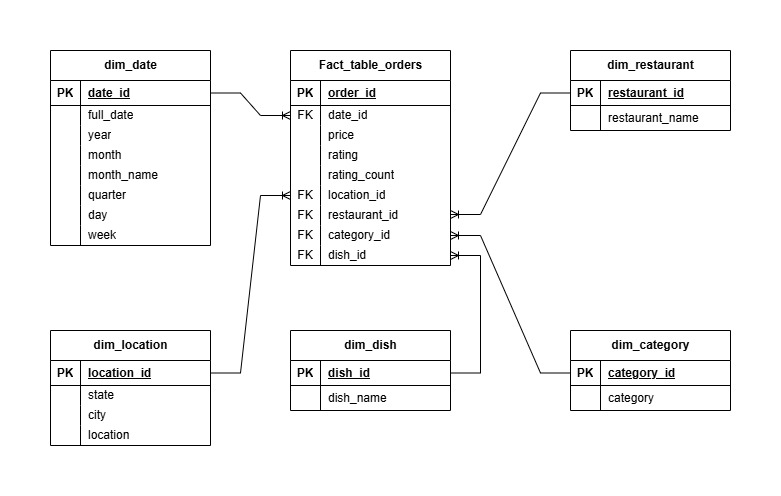
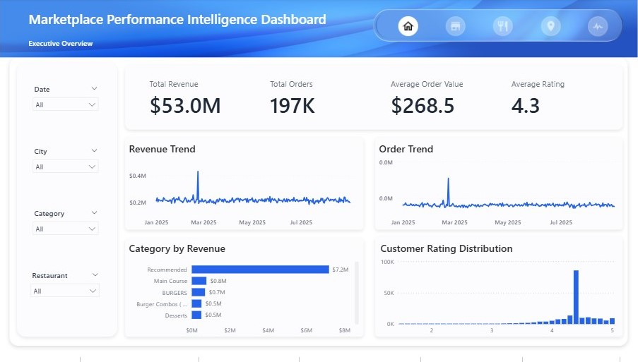
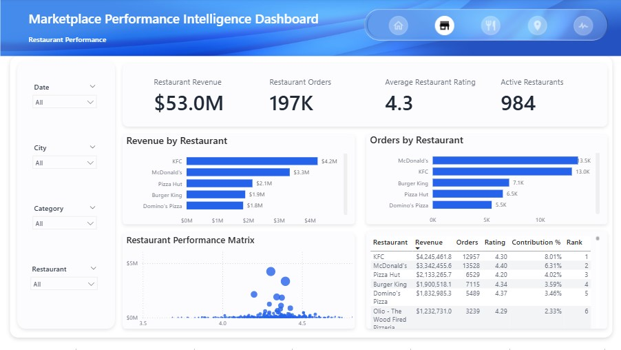
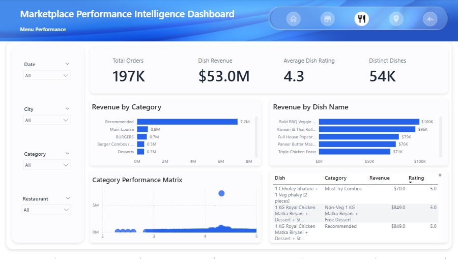
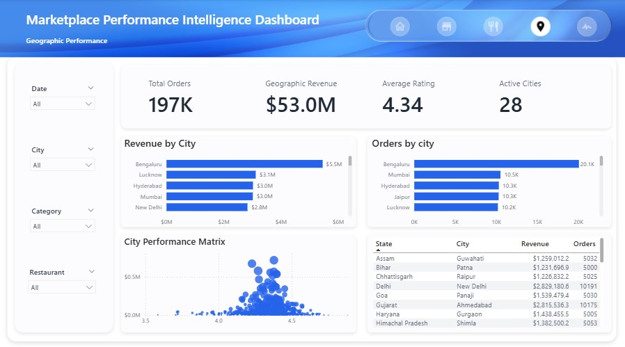
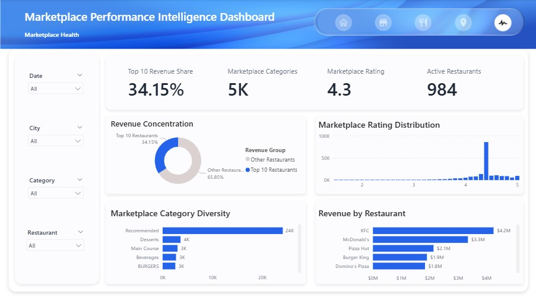

# Marketplace Performance Intelligence Dashboard

An end-to-end Business Intelligence solution built with **SQL Server** and **Power BI** to transform raw restaurant marketplace transaction data into business insights.

The project follows a complete BI workflow—from data ingestion and validation through dimensional modeling, SQL analysis, DAX calculations, and interactive dashboard development. The resulting solution enables business stakeholders to monitor marketplace performance, evaluate restaurant effectiveness, analyze menu performance, identify geographic opportunities, and assess overall marketplace health.

---

# Business Problem

Restaurant marketplaces generate large volumes of transactional data every day. While this data contains valuable operational insights, it is often distributed across multiple entities and difficult to analyze without a centralized reporting solution.

Business stakeholders require a dashboard capable of answering key business questions such as:

- How is the marketplace performing overall?
- Which restaurants contribute the most revenue?
- Which menu categories and dishes drive customer demand?
- Which cities represent the strongest markets?
- Is revenue overly dependent on a small number of restaurants?
- How healthy is the marketplace ecosystem?

Without a centralized reporting solution, identifying trends and making data-driven business decisions becomes significantly more difficult.

---

# Business Objectives

The objective of this project is to design and develop an interactive Business Intelligence solution that enables stakeholders to:

- Monitor overall marketplace performance.
- Evaluate restaurant performance and rankings.
- Analyze menu category and dish performance.
- Compare geographic performance across cities.
- Monitor customer satisfaction using ratings.
- Measure marketplace concentration and diversity.
- Support strategic decision-making through interactive reporting.

---

# Technology Stack

| Technology | Purpose |
|------------|---------|
| SQL Server | Data ingestion, ETL, validation and business analysis |
| Microsoft Excel | Initial data cleaning and preprocessing |
| Power BI | Interactive dashboard development |
| DAX | Business calculations and KPI development |
| CSV | Source dataset |
| Git & GitHub | Version control and project documentation |

---

# Solution Architecture

The project follows a structured Business Intelligence workflow.

```
CSV Dataset
      │
      ▼
Excel Data Cleaning
      │
      ▼
SQL Server Staging Table
      │
      ▼
Production Table
      │
      ▼
Dimension Tables
      │
      ▼
Star Schema
      │
      ▼
Power BI Data Model
      │
      ▼
DAX Measures
      │
      ▼
Interactive Dashboard
```

This layered approach separates raw data ingestion from analytical reporting while improving maintainability, scalability, and data quality.

---

# Data Model

The solution follows a **Star Schema** consisting of one fact table and five dimension tables.

## Fact Table

- fact_table_orders

## Dimension Tables

- dim_date
- dim_restaurant
- dim_category
- dim_location
- dim_dish

This dimensional model minimizes redundancy, improves query performance, and provides an optimized structure for analytical reporting in Power BI.

### Star Schema



---

# Data Preparation

Before building the dashboard, the dataset underwent several preparation and validation steps.

The workflow included:

- Loading raw CSV data into a SQL Server staging table
- Creating a production-ready table
- Data cleaning
- Data type standardization
- Duplicate detection and deletion
- Null value validation
- Dimension table creation
- Star schema implementation
- SQL business analysis
- Power BI data modeling
- DAX measure development

Supporting SQL scripts are available in the **scripts/** directory.

---

# Dashboard

The dashboard consists of five interactive report pages.

## Executive Overview

Provides an executive-level summary of marketplace performance.




---

## Restaurant Performance

Analyze restaurant performance and identify top contributors.



---

## Menu Performance

Analyze menu performance across categories and individual dishes.



---

## Geographic Performance

Evaluate marketplace performance across geographic regions.



---

## Marketplace Health

Assess overall marketplace health and revenue concentration.




---

# Key Findings

- The marketplace generated **$53.0M** in revenue from **197K orders**, with an Average Order Value of **$268.50** and an average customer rating of **4.34**.
- Revenue remained generally stable throughout the reporting period, with isolated periods of increased marketplace activity.
- The **Top 10 restaurants contribute 34.15%** of total marketplace revenue, indicating moderate marketplace concentration.
- **KFC** emerged as the highest-performing restaurant by revenue.
- The **Recommended** category generated the highest marketplace revenue among all menu categories.
- **Bengaluru** ranked as the highest-performing city by both revenue and order volume.
- Customer ratings are concentrated between **4.0 and 5.0**, indicating consistently positive customer experiences.
- The marketplace supports **984 active restaurants**, demonstrating strong marketplace diversity.

---

# Recommendations

Based on the analysis, the following recommendations are proposed:

- Strengthen partnerships with high-performing restaurants while supporting mid-tier restaurants to reduce revenue concentration.
- Expand and promote high-performing menu categories while reviewing underperforming categories for optimization opportunities.
- Replicate successful operational strategies from Bengaluru across other high-potential cities.
- Continue monitoring customer ratings to maintain consistently high service quality.
- Monitor revenue concentration over time to ensure long-term marketplace resilience.

---

# Assumptions & Limitations

## Assumptions

- Each record represents a completed marketplace transaction.
- Order prices accurately represent transaction values.
- Customer ratings accurately reflect customer satisfaction.
- The available data is representative of normal marketplace operations.

## Limitations

- Customer demographic information is unavailable.
- Operational costs and profitability are not included.
- Order cancellations and refunds are not represented.
- The dataset represents a single historical reporting period.
- Analysis is limited to the variables available within the dataset.

---

# Repository Structure

```text
Marketplace-Performance-Intelligence-Dashboard/
│
├── Dashboard/
│   └── Marketplace-Performance-Intelligence-Dashboard.pbix
│
├── data/
│   ├── raw/
│   │   └── marketplace_data.csv
│   │
│   └── processed/
│       ├── marketplace_data.csv
│       ├── stg_marketplace_data.csv
│       ├── fact_table_orders.csv
│       ├── dim_category.csv
│       ├── dim_date.csv
│       ├── dim_dish.csv
│       ├── dim_location.csv
│       └── dim_restaurant.csv
│
├── docs/
│   ├── business-requirements.md
│   ├── data-dictionary.md
│   ├── DAX calculations.md
│   └── business insights.md
│
├── images/
│   ├── schema.jpg
│   ├── executive.jpg
│   ├── restaurant.jpg
│   ├── menu.jpg
│   ├── geographic.jpg
│   └── marketplace.jpg
│
├── scripts/
│   ├── 00. database init.sql
│   ├── 01. load stg table.sql
│   ├── 02. create prd table.sql
│   ├── 03. load prd table.sql
│   ├── 04. data cleaning and validation.sql
│   ├── 05. schema creation.sql
│   ├── 06. dim load.sql
│   ├── 07. fact load.sql
│   ├── 08. marketplace performance.sql
│   ├── 09. restaurant performance.sql
│   ├── 10. menu performance.sql
│   ├── 11. geographic performance.sql
│   └── 12. marketplace health.sql
│
├── LICENSE
└── README.md
```

# Future Enhancements

Potential future improvements include:

- Profitability analysis
- Customer segmentation
- Customer lifetime value analysis
- Time intelligence (MoM, QoQ, YoY)
- Predictive analytics
- Power BI Service deployment with automated refresh
- Row-Level Security (RLS)
- Executive mobile dashboard

---

# Author

**Godwin Deborah Onoriode**

Data Analyst | SQL | Power BI | Excel

If you found this project interesting, feel free to connect with me on LinkedIn or explore more of my data analytics projects on GitHub.
